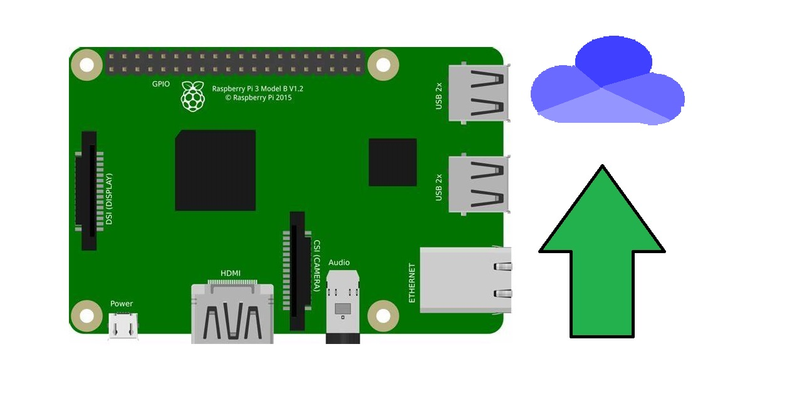
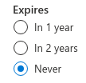

# raspberrypi-onedrive-backup
A simple way to backup your Raspberry Pi to your OneDrive account using Python 3.  

# Installation instructions:
## Installing dependencies
&nbsp;&nbsp;&nbsp;&nbsp;The only dependency is onedrive-sdk-python! Install it by running this:
```bash
sudo pip3 install git+https://github.com/OneDrive/onedrive-sdk-python.git
```
## Authentication
1. In order to get OneDrive access credentials, we open the [Azure app manager](https://portal.azure.com/#blade/Microsoft_AAD_RegisteredApps/ApplicationsListBlade). You may need to sign up for Azure.
2. Once the Azure page loads, click on .
3. Name your app `OneDrive Backup` to make it easier to find later.
4. Use the default setting for supported account types.
5. For the redirect URI, set the type to `Web` and the URI to `http://localhost:8080/`.
6. Click on  at the bottom, and it'll create your app!  
7. Copy the client ID to a place you'll be able to find it later.
8. Click on . Click on . 
9. Make sure you choose  for  (otherwise your backup will stop working!). Don't type anything for the description. Click on , and it'll create the secret.
9. Press the copy button, and put it into your notepad.
That's all the steps needed for getting your credentials!
## Setup
&nbsp;&nbsp;&nbsp;&nbsp;For the next part, backing up your Raspberry Pi, your Raspberry Pi should be running [Raspbian](https://www.raspberrypi.org/downloads/).
1. Download <a id="raw-url" href="auth.py?raw=true" download>auth.py</a> onto your Raspberry Pi.
2. Move the program to `/home/pi`.
3. Run it with Python 3. It will guide you through setting up `backup.py`. 
  
4. Next, download <a id="raw-url" href="backup.py?raw=true" download>backup.py</a>.
5. Change `client_id` to your client ID. You don't need your secret, since `auth.py` configured that.
6. Move it to the `/root` directory. That should be it!  
## Running
&nbsp;&nbsp;&nbsp;&nbsp;To manually backup your Pi, do this at the command line:
```bash
sudo python3 /replace/this/with/your/path/to/backup.py
```
## Scheduling
&nbsp;&nbsp;&nbsp;&nbsp;To run it every 3AM (don't worry, it compresses backups, deletes backups more than 1 week old, and removes temporary backup files), you can run this to quickly add it to your crontab: `(sudo crontab -l ; echo "0 3 * * * cd /root; python3 /root/backup.py")| sudo crontab -`. Or to manually run it, do `sudo -s`, type `cd /root`, and then run `python3 /root/backup.py`. (When done, don't forget to exit the sudo shell with "exit" to go back to your shell.) Enjoy your new backup program!  
  
&nbsp;&nbsp;&nbsp;&nbsp;I hope this helped you back up your Pi. Feel free to look around my code and make any pull requests if you need to. Happy backuping!  
